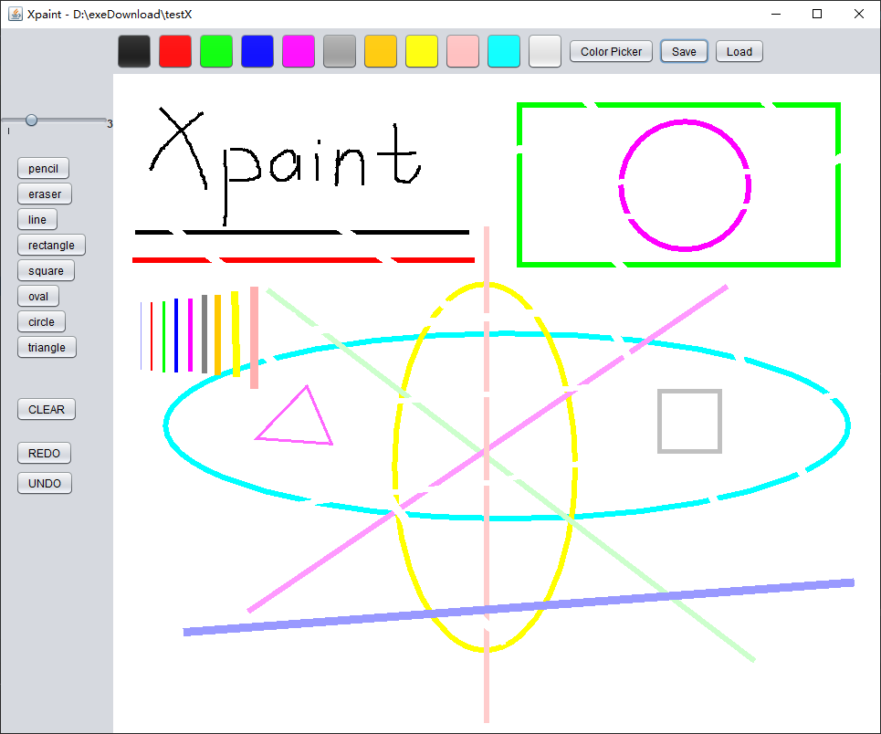

# Xpaint

postgraduate JAVA assignment: A paint (swing & awt)

features:

1. 6 shape and pencil and eraser
2. the color can be changed including color picker
3. Good scalability, each shape inherited from Shape
4. Drag the mouse to draw with auxiliary lines
5. The board can show all the shapes that have been drawn
6. Save shapes to file and Load it
7. the shape's thickness can be adjusted
8. CLEAR and REDO and UNDO

## Reference

1. UI mainly base on swing-paint-application@haxxorsid: [https://github.com/haxxorsid/swing-paint-application](https://github.com/haxxorsid/swing-paint-application)
2. logic mainly base on Java-SuperPaint-Application@Jimicy:  [https://github.com/Jimicy/Java-SuperPaint-Application](https://github.com/Jimicy/Java-SuperPaint-Application)
3. others